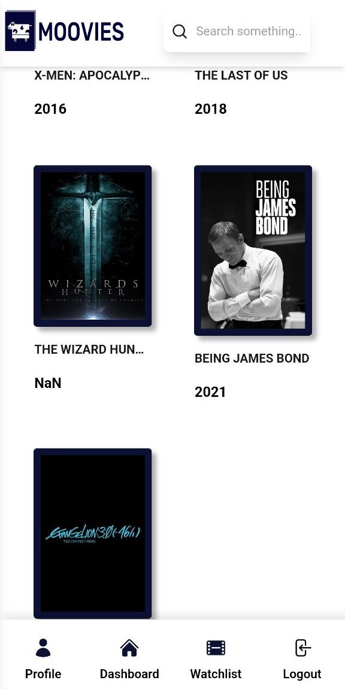
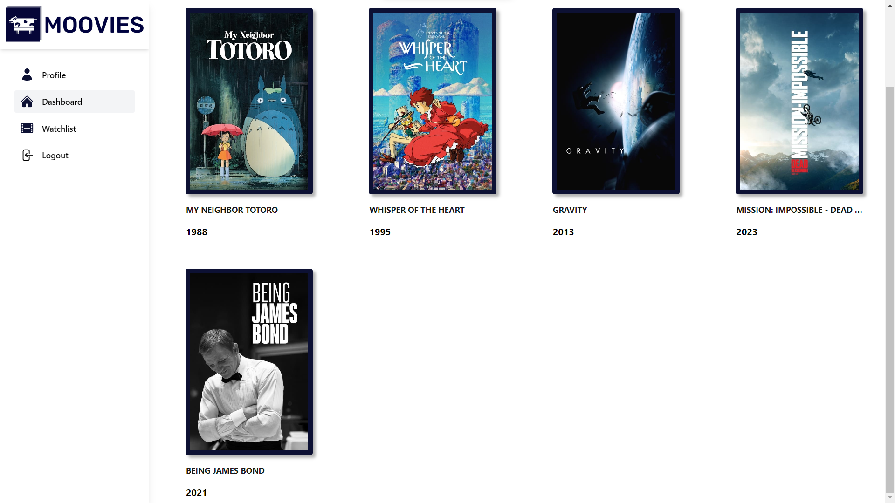
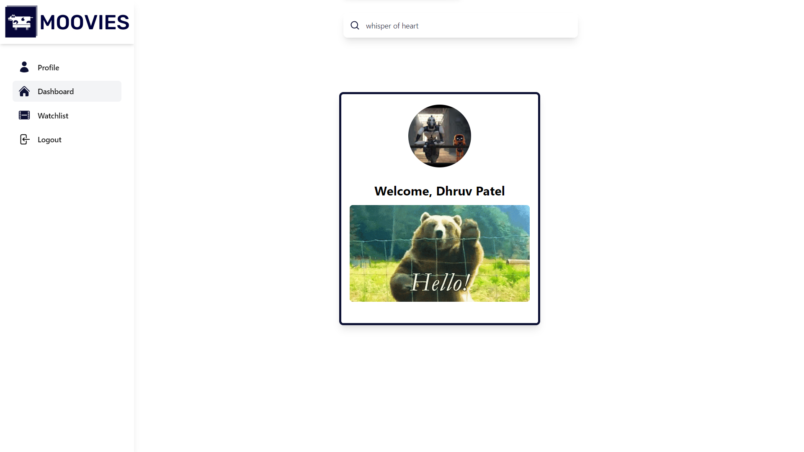

## MovieLibrary

🎥 A movie library app built using Firebase Authentication, TMDB API, React Router, React Context, Tailwind CSS, Vite, and Firebase Realtime Database.

## 🚀 Demo
Check out the live demo [here](https://cowmoovies.web.app/) .

## 💻 Technologies Used
- React
- Firebase Authentication
- Firebase Realtime Database
- TMDB API
- React Router
- React Context
- Tailwind CSS
- Vite

## 📷 Screenshots

###  📱 Mobile View

#### Watchlist


###  💻 Laptop View

#### Wathchlist 


#### Profile 



## 🛠️ Installation

1. Clone the repository

2. Run  ``npm install`` to install the dependencies

3. Create a .env file in the root directory of the project

4. Add your Firebase configuration and tmdb api key to the .env file

``` .env
VITE_FIREBASE_API_KEY=your_api_key
VITE_FIREBASE_AUTH_DOMAIN=your_auth_domain
VITE_FIREBASE_PROJECT_ID=your_project_id
VITE_FIREBASE_STORAGE_BUCKET=your_storage_bucket
VITE_FIREBASE_MESSAGING_SENDER_ID=your_sender_id
VITE_FIREBASE_APP_ID=your_app_id
VITE_MEASUREMENT_ID=your_measurent_id
VITE_TMDB_API_KEY=your_tmdb_api_key
````

5. Run  ``npm run dev`` to start the development server

6. Open http://localhost:8000 to view the app in the browser

## 🔑 Authentication

The app uses Firebase Authentication to authenticate users. Users can sign in with their Google account.


## 🎬 Movie Data

The app fetches movie data from the TMDB API. Users can view movie details, search for movies, and add movies to their watchlist.
